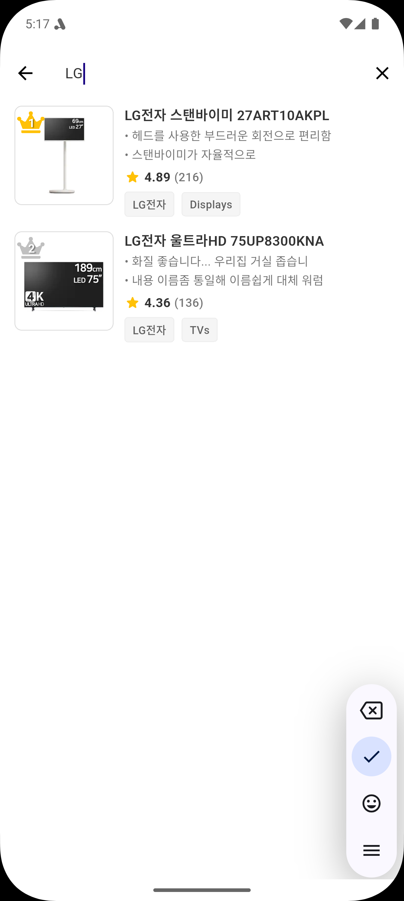

# Gadget Rank

A product review and ranking application built with Flutter following clean architecture principles.


## Features

- Browse top-rated gadgets and electronics
- View detailed product specifications
- Read user reviews with ratings and photos
- User profiles with review history and stats
- Multi-language support (English and Korean)
- Dark and light theme
- Beautiful animations

## Screenshots

<p float="left">
  
   
  
  
</p>

<p float="left">
  
  
  
  
</p>

## App Demo

Check out our app in action:

<video width="320" height="240" controls>
  <source src="assets/attachment/video.webm" type="video/webm">
  Your browser does not support the video tag.
</video>

_Note: To view the demo video, download the repository and open this README in a markdown viewer that supports video._

## Architecture

This project follows Clean Architecture principles with three main layers:

### Domain Layer

Core business logic and entities independent of any framework or platform.

- Entities: Product, Review, User
- Repositories: Interfaces defining data operations
- Use Cases: Business logic operations

### Data Layer

Implementation of the domain layer interfaces.

- Models: Data models extending domain entities
- Repositories: Implementation of domain repositories
- Data Sources: Local data providers (dummy data for now)

### Presentation Layer

UI components and state management.

- Screens: Application screens
- Widgets: Reusable UI components
- Providers: State management using Provider

## State Management

This project uses Provider for state management, following the Business Logic Component pattern.

## Dependencies

- **State Management**: provider
- **Dependency Injection**: get_it
- **Logging**: logger
- **Utilities**: equatable, dartz
- **UI Components**: cached_network_image, flutter_rating_bar, shimmer
- **Localization**: flutter_localizations, intl

## Project Structure

```
lib/
├── core/                     # Core functionality
│   ├── di/                   # Dependency Injection
│   ├── error/                # Error handling
│   ├── util/                 # Utilities
│   ├── config/               # Configurations
│   └── animation/            # Animation utilities
│
├── domain/                   # Business Logic Layer
│   ├── entities/             # Enterprise business objects
│   ├── repositories/         # Repository interfaces
│   └── usecases/             # Business logic use cases
│
├── data/                     # Data Layer
│   ├── models/               # Data models
│   ├── repositories/         # Repository implementations
│   └── datasources/          # Data providers
│
├── presentation/             # UI Layer
│   ├── providers/            # State management
│   ├── screens/              # App screens
│   ├── widgets/              # Shared widgets
│   ├── animations/           # Custom animations
│   └── l10n/                 # Localization
│
└── di/                       # Main Dependency Injection
```

## Testing

The project includes comprehensive test coverage:

- **Unit Tests**: Testing domain use cases and repositories
- **Widget Tests**: Testing UI components
- **Integration Tests**: Testing end-to-end application flows

## Setup Instructions

1. Clone the repository
2. Install dependencies:
   ```
   flutter pub get
   ```
3. Run the app:
   ```
   flutter run
   ```

## Testing

Run tests using the following commands:

```
flutter test                # Run all tests
flutter test test/unit      # Run unit tests
flutter test test/widget    # Run widget tests
flutter test integration_test # Run integration tests
```

## License

This project is licensed under the MIT License - see the LICENSE file for details.
